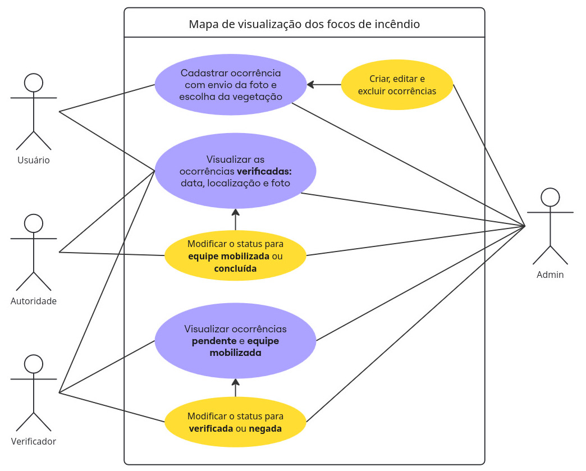

# Monitoramento de incêndio em Goiás com apoio da ciência cidadã

* **Dupla:** Izadora Bernardi e Pedro Lucas Siqueira da Paixão
* **Instituto:** IF Goiano - Campus Rio Verde
* **Disciplina:** Projeto Integrador II
---
## Veja o poster do projeto no link abaixo
[Pôster do Projeto (PDF)](docs/poster/poster.pdf)

## Casos de uso - Atores e Status de ocorrência

### Status de ocorrência
* `Pendente`: status inicial de ocorrência recém criada;
* `Negada`: ocorrência que foi recusada pelo verificador. Será excluída do mapa;
* `Verificada`: ocorrência que será visível no mapa;
* `Equipe mobilizada:` aparece como **verificada** no mapa e **equipe mobilizada** para autoridade;
* `Concluída:` ocorrência finalizada. Será excluída do mapa.

### Atores
* Qualquer ator é capaz de visualizar as ocorrências verificadas presentes no mapa de Goiás;
* `Usuário:` pode cadastrar novas ocorrências e visualizar os status de **pendente**, **veficada** ou **negada**, somente dessas que cadastrou;
* `Verificador:` pode visualizar as ocorrências de status **pendente** e modificar o status para **veficada** ou **negada**;
* `Autoridade:` pode visualizar as ocorrências de status **verificada** e modificar para o status de **equipe mobilizada** e depois para o status de **concluída**;
* `Administrador:` tem funções de construção e manutenção do sistema. É o responsável pelo cadastro de novos atores `verificador` e `autoridade`, além de poder modificar livremente os status de ocorrências.
